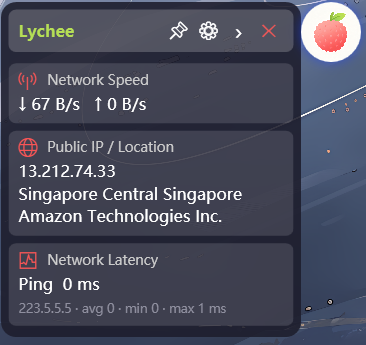

# 🍈 Lychee

[English](./README.md) | 简体中文

一个极小的 Windows 桌面悬浮球，置顶显示 CPU、内存、网速、公网 IP 和延迟。鼠标悬停展开信息面板，移开自动收起。基于 .NET 8 WPF + WinForms，无需安装、无需管理员权限、无后台服务。



适合不想 alt-tab 切任务管理器看系统状态的用户——远程办公盯 VPN 状态、开发者跑长任务、或者单纯觉得完整系统监视器太重的人。

## 🚀 快速开始

从 [Releases](https://github.com/Qinging-wu/Lychee/releases) 下载 `Lychee.exe`，双击运行。无需安装，无需管理员权限。

关闭方式：点击面板上的 **✕**，或右键托盘图标 → 退出。

## ✨ 功能

- **📅 日期时间** — 每秒刷新
- **🌐 网络速度** — 自动选择活动网卡，每秒采样上传/下载速率
- **📍 公网 IP / 归属地** — 每 20 秒查询 ip-api.com，IP 变化时弹出提醒 + 托盘气泡（可选）
- **💻 CPU 使用率** — 通过 `GetSystemTimes` 采集全核利用率，每秒刷新
- **🧠 内存** — 通过 `GlobalMemoryStatusEx` 获取 RAM 占用和页面文件统计
- **⏱️ 网络延迟** — 每 5 秒 ping 223.5.5.5 / 1.1.1.1 / 8.8.8.8，取最优值
- **🖼️ 帧性能**（v1.1.0 · 实验性）— 两种模式：
  - *桌面输出* — 通过 `DwmGetCompositionTimingInfo` 采样 DWM 合成帧率，显示 FPS + 显示刷新率
  - *前台应用* — 启动 PresentMon 2.5.1 采集进程级帧呈现，报告当前 FPS、60 秒平均、1% Low 和帧范围。需要**管理员权限**或加入 `Performance Log Users` 组

每个模块都可以在设置中单独开关。

### v1.1.1 更新内容

| 变更 | 说明 |
|---|---|
| 📁 文件夹发布 | 从单文件 exe 改为文件夹发布，减少杀软误报 |

### v1.1.0 更新内容

| 变更 | 说明 |
|---|---|
| 🖼️ 帧性能（实验性） | 桌面 DWM 输出 + PresentMon 前台应用模式 |
| ⚙️ 帧监控设置 | 桌面/应用模式切换 + 管理员提权提示 |
| 🔧 PresentMon 集成 | 内置 PresentMon 2.5.1，ETW 会话管理 |

## 🖱️ 使用

- **👆 悬停**悬浮球展开面板，移开自动收起
- **✋ 拖拽**悬浮球到任意显示器任意位置，面板根据屏幕位置自动翻转方向
- **👆👆 双击**悬浮球固定/取消固定面板
- **📌 固定** — 面板保持展开，不再跟随鼠标自动收起
- **⚙️ 设置** — 打开设置窗口
- **◀️ 收起** — 强制收起面板
- **❌ 退出** — 退出应用
- **📋 托盘图标** — 右键弹出菜单（显示/隐藏、设置、退出）；双击切换可见性

公网 IP 发生变化时（可能是 VPN 掉线或网络切换），右下角弹出红色提醒并显示托盘气泡，标明新旧 IP。

## 🔧 构建

需要 .NET SDK 8.0+（包含 WPF + WinForms 工作负载）。

```powershell
dotnet build -c Release
dotnet publish -c Release -r win-x64
```

产物路径：`bin\Release\net8.0-windows\win-x64\publish\Lychee.exe`（自包含，双击运行）。

## 🏗️ 架构

```
Lychee/
├── Core/                       # 核心抽象
│   ├── IInfoModule.cs          # 模块接口 + InfoModuleBase
│   ├── ModuleManager.cs        # 模块注册 / 生命周期
│   ├── SettingsService.cs      # JSON 设置持久化
│   ├── TrayIconService.cs      # 系统托盘图标
│   └── IpChangedEventArgs.cs   # IP 变化事件
├── Modules/                    # 内置模块
│   ├── DateTimeModule.cs
│   ├── NetworkSpeedModule.cs
│   ├── PublicIpModule.cs
│   ├── CpuModule.cs
│   ├── MemoryModule.cs
│   ├── LatencyModule.cs
│   └── FpsModule.cs            # v1.1.0 · 实验性
├── Core/
│   ├── FrameMetrics.cs         # 帧监控类型与接口
│   ├── DwmFrameMetricsSource.cs
│   ├── PresentMonFrameMetricsSource.cs
│   ├── ForegroundProcessProvider.cs
│   └── ...
```

### 🔌 模块接口

```csharp
public interface IInfoModule : IDisposable
{
    string Id { get; }              // 唯一标识
    string DisplayName { get; }     // 列表标签
    string Icon { get; }            // Segoe MDL2 Assets 字形
    bool IsEnabled { get; set; }    // 用户开关
    string CurrentValue { get; }    // 当前值（数据绑定）
    string? Detail { get; }         // 可选的副行
    event EventHandler? ValueChanged;
    void Start();
    void Stop();
}
```

### 📦 新增模块

1. 继承 `InfoModuleBase`，实现 `Start()` / `Stop()`，数据更新时给 `CurrentValue` 赋值即可：

```csharp
using Lychee.Core;

public sealed class WeatherModule : InfoModuleBase
{
    public override string Id => "weather";
    public override string DisplayName => "Weather";
    public override string Icon => "";

    private PeriodicTimer? _timer;
    private CancellationTokenSource? _cts;

    public override void Start()
    {
        _cts = new CancellationTokenSource();
        _timer = new PeriodicTimer(TimeSpan.FromMinutes(10));
        _ = Task.Run(async () =>
        {
            await QueryAsync(_cts.Token);
            while (await _timer.WaitForNextTickAsync(_cts.Token))
                await QueryAsync(_cts.Token);
        });
    }

    private async Task QueryAsync(CancellationToken ct)
    {
        // ... 拉取数据 ...
        CurrentValue = "上海 26°C 晴";
    }

    public override void Stop()
    {
        _cts?.Cancel();
        _timer?.Dispose();
    }
}
```

2. 在 `MainWindow.xaml.cs` 中注册：

```csharp
_moduleManager.RegisterModule(new WeatherModule());
```

3. 重新编译。模块会自动出现在信息面板和设置开关列表中，无需改动 UI 代码。

## ⚙️ 配置文件

`%AppData%\Lychee\settings.json`

```json
{
  "AlwaysShowPanel": false,
  "AlertOnIpChange": true,
  "ShowTrayIcon": true,
  "FloatingBallSize": 56,
  "ModuleEnabled": {
    "datetime": true,
    "network-speed": true,
    "public-ip": true,
    "cpu": true,
    "memory": true,
    "latency": true,
    "fps": true
  }
}
```

## ⚠️ 已知限制

- 部分独占全屏游戏可能仍会盖住悬浮球
- 归属地查询不可用时，公网 IP 可能仅显示数字本身（无城市/国家信息）

## 📄 许可证

MIT
